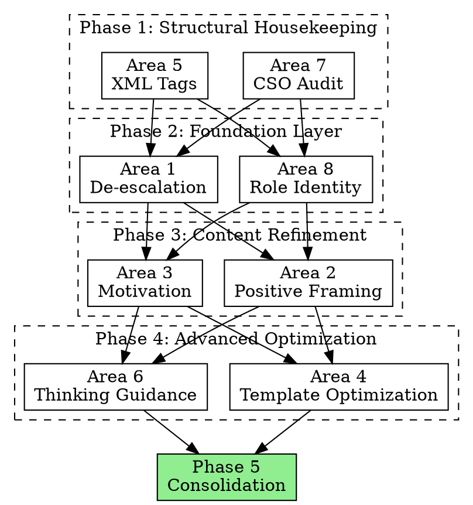

# Superpowers Prompt Optimization Plan

> **For agentic workers:** REQUIRED SUB-SKILL: Use superpowers:subagent-driven-development (recommended) or superpowers:executing-plans to implement this plan task-by-task. Steps use checkbox (`- [ ]`) syntax for tracking.

**Goal:** Audit and improve all Superpowers skill prompts against Claude 4.6 prompting best practices documented in `docs/prompting-best-practices.md`.

**Architecture:** 8 independent improvement areas executed in 4 dependency-ordered phases. Each area is a read-only audit that produces a diff-ready report, followed by a consolidation phase that merges overlapping recommendations before any edits are applied.

**Reference:** `docs/prompting-best-practices.md` (source of truth for all best practice citations)

---

## Scope

### Files In Scope

**14 SKILL.md files:**
- `skills/brainstorming/SKILL.md`
- `skills/dispatching-parallel-agents/SKILL.md`
- `skills/executing-plans/SKILL.md`
- `skills/finishing-a-development-branch/SKILL.md`
- `skills/handoff-acceptance/SKILL.md`
- `skills/receiving-code-review/SKILL.md`
- `skills/requesting-code-review/SKILL.md`
- `skills/subagent-driven-development/SKILL.md`
- `skills/systematic-debugging/SKILL.md`
- `skills/test-driven-development/SKILL.md`
- `skills/using-git-worktrees/SKILL.md`
- `skills/using-superpowers/SKILL.md`
- `skills/verification-before-completion/SKILL.md`
- `skills/writing-plans/SKILL.md`
- `skills/writing-skills/SKILL.md`

**3 subagent prompt templates:**
- `skills/subagent-driven-development/implementer-prompt.md`
- `skills/subagent-driven-development/spec-reviewer-prompt.md`
- `skills/subagent-driven-development/code-quality-reviewer-prompt.md`

**1 formal agent file:**
- `agents/code-reviewer.md`

**Reference material (read-only, for context enrichment):**
- `docs/process-improvement-findings/` (incident context for Area 3)
- `docs/prompting-best-practices.md` (best practice citations for all areas)

### What Will NOT Change

- **Rationalization tables** — Effective for discipline skills, match best practice of using examples to steer behavior
- **Flowcharts** — Well-structured decision aids; writing-skills CSO rules already govern their use
- **Iron laws (concept)** — Sound; only the framing intensity needs adjustment
- **Two-stage review architecture** — SDD process is architecturally sound; only prompt language within it needs tuning

---

## Execution Strategy

### Phase 1: Structural Housekeeping (parallel, read-only)

Zero-dependency work. Fixes frontmatter and tag vocabulary before anyone touches body content. Fast, low-risk.

- **Area 7** — Description field / CSO audit
- **Area 5** — XML tag consistency audit

### Phase 2: Foundation Layer (parallel, read-only)

Role statements shape how everything else reads. De-escalation adjusts the tone baseline. These two run in parallel since they touch different parts of files (opening section vs. throughout).

- **Area 8** — Role identity for subagent prompts
- **Area 1** — Aggressive language de-escalation

### Phase 3: Content Refinement (parallel, read-only)

Now that tone is calibrated (Phase 2), reframe negatives into positives and add "why" explanations. These two are independent of each other but both depend on the tone baseline from Phase 2.

- **Area 2** — Positive framing rewrites
- **Area 3** — Context/motivation enrichment

### Phase 4: Advanced Optimization (parallel, read-only)

Highest-judgment work. Templates already have roles (Phase 2) and de-escalated language (Phase 2), so Area 4 can focus on adding the right new content without duplicating what the role already accomplishes. Area 6 needs the final language to judge where thinking guidance adds value vs. clutters.

- **Area 4** — Subagent prompt template optimization
- **Area 6** — Adaptive thinking guidance

### Phase 5: Consolidation (sequential, produces edits)

Merge all reports. Where recommendations overlap (especially Areas 1+2 touching the same passages, and Areas 4+8 touching the same templates), resolve conflicts. Present unified diff proposals for human review before any edits are applied.

---

## Improvement Areas

### Area 1: Aggressive Language De-escalation

**Best practice:** *"Where you might have said 'CRITICAL: You MUST use this tool when...', you can use more normal prompting like 'Use this tool when...'" ... "these models may now overtrigger."*

**Affected files (worst offenders):**
- `using-superpowers/SKILL.md` — `EXTREMELY-IMPORTANT`, `ABSOLUTELY MUST`, "This is not negotiable. This is not optional."
- `test-driven-development/SKILL.md` — "Delete means delete", aggressive iron law framing
- `verification-before-completion/SKILL.md` — "Claiming work is complete without verification is dishonesty"
- `systematic-debugging/SKILL.md` — "Violating the letter of this process is violating the spirit"
- `brainstorming/SKILL.md` — `<HARD-GATE>` tags, "This applies to EVERY project"

**Subagent task:** Audit every skill for language that was appropriate for pre-4.6 models but now causes overtriggering. Propose toned-down alternatives that preserve the behavioral constraint without the aggressive framing. Produce a diff-ready report per file.

**Scope:** All 14 SKILL.md files + 3 prompt templates

**Model:** Sonnet | **Complexity:** Medium

---

### Area 2: Positive Framing Rewrites

**Best practice:** *"Tell Claude what to do instead of what not to do"*

**Affected files (worst offenders):**
- `receiving-code-review/SKILL.md` — "NEVER" list of forbidden responses dominates the guidance
- `writing-skills/SKILL.md` — Long "Don't create for" and anti-pattern lists
- `subagent-driven-development/SKILL.md` — 12-item "Never" list in Red Flags
- `using-superpowers/SKILL.md` — 12-row "Red Flags" table framed as negatives

**Subagent task:** For each skill, identify sections where negative framing dominates. Propose rewrites that lead with the desired behavior, keeping the "don't" items as secondary reinforcement. Measure the ratio of positive-to-negative instructions before and after.

**Scope:** All 14 SKILL.md files

**Model:** Sonnet | **Complexity:** Medium

---

### Area 3: Context/Motivation Enrichment

**Best practice:** *"Providing context or motivation behind your instructions... can help Claude better understand your goals"*

**Affected files:**
- `executing-plans/SKILL.md` — Very terse, rules without "why" (e.g., "Follow plan steps exactly" — why?)
- `finishing-a-development-branch/SKILL.md` — Procedural steps with no motivation
- `using-git-worktrees/SKILL.md` — Safety rules without incident context
- `dispatching-parallel-agents/SKILL.md` — "Don't use when" list without explaining the failure mode
- `requesting-code-review/SKILL.md` — "Never skip review because 'it's simple'" — why not?

**Subagent task:** For each skill, identify rules/constraints that lack a "why" explanation. Add 1-sentence motivation behind each. Cross-reference `docs/process-improvement-findings/` for real incident context where available.

**Scope:** All 14 SKILL.md files, with reference to `docs/process-improvement-findings/`

**Model:** Sonnet | **Complexity:** Medium

---

### Area 4: Subagent Prompt Template Optimization

**Best practice:** Multiple patterns from the "Agentic systems" and "Tool use" sections.

**Affected files:**
- `implementer-prompt.md` — Missing: hallucination prevention (`investigate_before_answering`), thinking guidance, file creation cleanup
- `spec-reviewer-prompt.md` — Missing: parallel tool calling for reading multiple files, explicit output format
- `code-quality-reviewer-prompt.md` — Very thin (18 lines); delegates to code-reviewer.md but lacks the specific quality additions it promises

**Specific improvements from best practices:**
1. Add `<investigate_before_answering>` to reviewer prompts (prevents speculation)
2. Add thinking guidance to implementer prompt ("After receiving tool results, reflect on quality...")
3. Add parallel tool calling guidance to reviewer prompts (read multiple changed files at once)
4. Add file cleanup instruction to implementer prompt ("If you create temporary files, clean up...")
5. Add overengineering guard to implementer prompt (the `<avoid_overengineering>` pattern)

**Subagent task:** Review each prompt template against the "Agentic systems" section of best practices. Propose additions from the standard prompt snippets provided in the best practices doc. Draft updated templates. Note: by Phase 4, these templates will already have role statements (Area 8) and de-escalated language (Area 1) — account for what the role already accomplishes before adding redundant constraints.

**Scope:** 3 prompt templates + `agents/code-reviewer.md`

**Model:** Sonnet | **Complexity:** High

---

### Area 5: XML Tag Consistency Audit

**Best practice:** *"Use consistent, descriptive tag names across your prompts"*

**Current state is inconsistent:**
- `using-superpowers/SKILL.md` uses `<EXTREMELY-IMPORTANT>`, `<SUBAGENT-STOP>`
- `brainstorming/SKILL.md` uses `<HARD-GATE>`
- `writing-skills/SKILL.md` uses `<Good>`, `<Bad>`
- `test-driven-development/SKILL.md` uses `<Good>`, `<Bad>`
- Other skills use no XML tags at all

**Subagent task:** Catalog all XML tags used across skills. Propose a consistent tag vocabulary (e.g., `<required>`, `<example-good>`, `<example-bad>`, `<gate>`, `<stop-condition>`). Verify tags nest properly and don't conflict with Claude's internal parsing.

**Scope:** All 14 SKILL.md files + 3 prompt templates

**Model:** Sonnet | **Complexity:** Low

---

### Area 6: Adaptive Thinking Guidance

**Best practice:** *"Claude Opus 4.6 does significantly more upfront exploration... If your prompts previously encouraged the model to be more thorough, you should tune that guidance"*

**Current state:** No skill currently addresses Claude's thinking behavior. Several skills could benefit:

- `systematic-debugging/SKILL.md` — Could benefit from "After receiving tool results, reflect on quality" guidance in Phase 1
- `brainstorming/SKILL.md` — Could use thinking guidance to prevent over-exploring before asking the user
- `subagent-driven-development/SKILL.md` — Controller could use "choose an approach and commit to it" to prevent overthinking between tasks
- `writing-plans/SKILL.md` — Planning benefits from focused thinking, not sprawling exploration

**Subagent task:** Identify which skills would benefit from thinking steering (either encouraging or constraining it). Propose specific thinking guidance snippets for each, drawing from the best practices examples. Consider whether skill-level guidance conflicts with user-level effort settings.

**Scope:** All 14 SKILL.md files (identify applicable subset)

**Model:** Sonnet | **Complexity:** Medium

---

### Area 7: Description Field / CSO Verification

**Best practice (internal, from writing-skills):** *"Description = When to Use, NOT What the Skill Does"*

**Current state — potential violations:**
- `brainstorming/SKILL.md` — "Explores user intent, requirements and design before implementation" (summarizes workflow)
- `handoff-acceptance/SKILL.md` — "Verify external handoff packages before consumption" (describes what it does, not when to use)

**Subagent task:** Audit every skill's `description:` field against the CSO rules in writing-skills. Verify none summarize workflow. Verify all start with "Use when..." and describe triggering conditions only. Propose fixes for any that violate.

**Note:** When a description is changed in a SKILL.md, the corresponding command stub at `~/.claude/commands/superpowers/<name>.md` must also be updated — SKILL.md frontmatter does not propagate to the picker automatically.

**Scope:** All 14 SKILL.md files (description field only)

**Model:** Sonnet | **Complexity:** Low

---

### Area 8: Role Identity for Subagent Prompts

**Best practice:** *"Setting a role in the system prompt focuses Claude's behavior and tone for your use case. Even a single sentence makes a difference."*

**Current state:** All three subagent prompt templates open with task framing ("You are implementing...", "You are reviewing...") but never establish an identity that shapes how Claude approaches the work. Each subagent starts with zero session history — a role statement does more work here than anywhere else in the skill set.

**Affected files:**
- `implementer-prompt.md` — No role. Opens with "You are implementing Task N"
- `spec-reviewer-prompt.md` — No role. Opens with "You are reviewing whether an implementation matches"
- `code-quality-reviewer-prompt.md` — Thin delegation, no role
- `agents/code-reviewer.md` — Formal agent file, verify role presence

**Proposed roles:**

| Template | Role |
|----------|------|
| Implementer | Focused implementation engineer — builds exactly what the spec asks, nothing more |
| Spec reviewer | Skeptical spec compliance auditor — verifies by reading code, never trusts reports |
| Code quality reviewer | Experienced code reviewer — focused on maintainability, test quality, clean architecture |

**Why separate from Area 4:** Area 4 adds best-practice prompt snippets (hallucination prevention, parallel tools, thinking guidance, overengineering guards). Area 8 is about *identity* — a single opening statement that shapes how all subsequent instructions land. Role-setting changes the frame through which the subagent interprets everything else. Testing role statements independently lets us measure whether identity framing alone improves compliance, separate from the mechanical prompt additions in Area 4.

**Subagent task:** For each subagent prompt template, propose a role statement that reinforces the behavioral intent already present in the template. Verify the role doesn't conflict with the task framing. Test whether the role makes existing constraint language redundant (potential for simplification). Produce before/after versions of each template's opening section.

**Scope:** 3 prompt templates + `agents/code-reviewer.md`

**Model:** Sonnet | **Complexity:** Low-Medium

---

## Phase Dependency Diagram

## Risk Mitigation

**Rework between Phase 3 and Phase 4:** Phase 3 (framing + motivation) works at the sentence level while Phase 4 (template optimization) works at the structural level. Different granularities minimize conflict.

**Areas 1 and 2 touching the same passages:** Area 1 runs in Phase 2, Area 2 in Phase 3. Area 2 uses Area 1's de-escalated output as its baseline, avoiding conflicting rewrites.

**Areas 4 and 8 touching the same templates:** Area 8 runs in Phase 2, Area 4 in Phase 4. Area 4 accounts for roles already being in place and avoids adding constraints that the role already covers.

**Command stub drift (Area 7):** When description fields change, the corresponding `~/.claude/commands/superpowers/<name>.md` files must be updated separately. The consolidation phase (Phase 5) must include a command stub update step.
