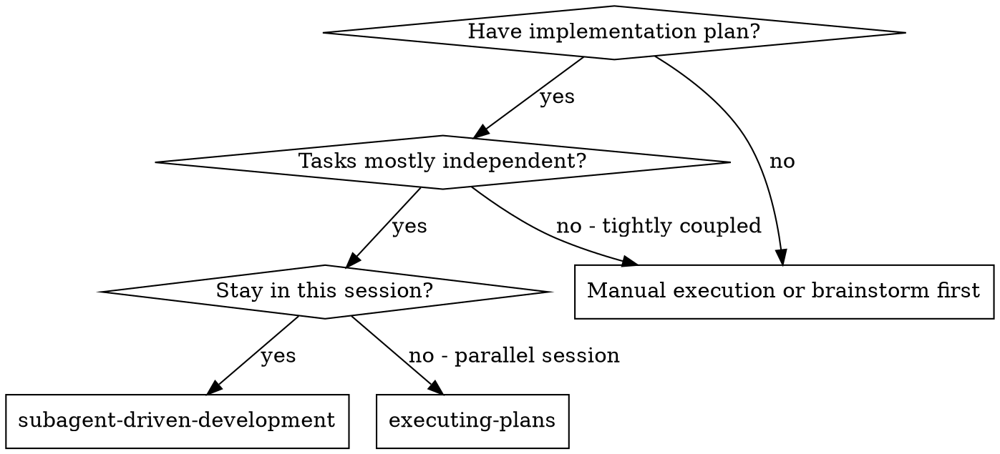

# Subagent-Driven Development

Execute plan by dispatching fresh subagent per task, with two-stage review after each: spec compliance review first, then code quality review.

**Why subagents:** You delegate tasks to specialized agents with isolated context. By precisely crafting their instructions and context, you ensure they stay focused and succeed at their task. They should never inherit your session's context or history — you construct exactly what they need. This also preserves your own context for coordination work.

**Core principle:** Fresh subagent per task + two-stage review (spec then quality) = high quality, fast iteration

**Continuous execution:** Do not pause to check in with your human partner between tasks. Execute all tasks from the plan without stopping. The only reasons to stop are: BLOCKED status you cannot resolve, ambiguity that genuinely prevents progress, or all tasks complete. "Should I continue?" prompts and progress summaries waste their time — they asked you to execute the plan, so execute it.

## When to Use



**vs. Executing Plans (parallel session):**
- Same session (no context switch)
- Fresh subagent per task (no context pollution)
- Two-stage review after each task: spec compliance first, then code quality
- Faster iteration (no human-in-loop between tasks)

## The Process

```dot
digraph process {
    rankdir=TB;

    subgraph cluster_ingestion {
        label="Plan Ingestion (before task loop)";
        "Read full plan document" [shape=box];
        "Extract Contract Constraints" [shape=box];
        "Has Source Contracts?" [shape=diamond];
        "Read source files referenced in contracts" [shape=box];
        "Extract Write-Scope Partitioning table" [shape=box];
        "Create <feature-dir>/deviations.md (empty, with header)" [shape=box];
        "Task 0 in plan?" [shape=diamond];
        "Verify Task 0 is first in TodoWrite" [shape=box];
        "Create TodoWrite with all tasks" [shape=box];

        "Read full plan document" -> "Extract Contract Constraints";
        "Extract Contract Constraints" -> "Has Source Contracts?";
        "Has Source Contracts?" -> "Read source files referenced in contracts" [label="yes"];
        "Has Source Contracts?" -> "Extract Write-Scope Partitioning table" [label="no"];
        "Read source files referenced in contracts" -> "Extract Write-Scope Partitioning table";
        "Extract Write-Scope Partitioning table" -> "Create <feature-dir>/deviations.md (empty, with header)";
        "Create <feature-dir>/deviations.md (empty, with header)" -> "Task 0 in plan?";
        "Task 0 in plan?" -> "Verify Task 0 is first in TodoWrite" [label="yes"];
        "Task 0 in plan?" -> "Create TodoWrite with all tasks" [label="no"];
        "Verify Task 0 is first in TodoWrite" -> "Create TodoWrite with all tasks";
    }

    subgraph cluster_task0 {
        label="Task 0: Contract Verification (if present)";
        "Dispatch Task 0 implementer" [shape=box];
        "Contract test passes?" [shape=diamond];
        "Contract facts match plan assumptions?" [shape=diamond];
        "STOP: escalate to human — plan needs revision" [shape=box style=filled fillcolor=red];
        "Proceed to task loop" [shape=box style=filled fillcolor=lightblue];

        "Dispatch Task 0 implementer" -> "Contract test passes?";
        "Contract test passes?" -> "STOP: escalate to human — plan needs revision" [label="no"];
        "Contract test passes?" -> "Contract facts match plan assumptions?" [label="yes"];
        "Contract facts match plan assumptions?" -> "STOP: escalate to human — plan needs revision" [label="no"];
        "Contract facts match plan assumptions?" -> "Proceed to task loop" [label="yes"];
    }

    subgraph cluster_per_task {
        label="Per Task";
        "Dispatch implementer subagent (./implementer-prompt.md)\n+ Contract Constraints passthrough" [shape=box];
        "Implementer subagent asks questions?" [shape=diamond];
        "Answer questions, provide context" [shape=box];
        "Implementer subagent implements, tests, commits, self-reviews" [shape=box];
        "Log DONE_WITH_CONCERNS to <feature-dir>/deviations.md?" [shape=diamond];
        "Append concerns to <feature-dir>/deviations.md" [shape=box];
        "Declare review tier (full/standard/minimum)" [shape=box];
        "Dispatch spec reviewer subagent (./spec-reviewer-prompt.md)" [shape=box];
        "Spec reviewer subagent confirms code matches spec?" [shape=diamond];
        "Implementer subagent fixes spec gaps" [shape=box];
        "Dispatch code quality reviewer subagent (./code-quality-reviewer-prompt.md)" [shape=box];
        "Code quality reviewer subagent approves?" [shape=diamond];
        "Implementer subagent fixes quality issues" [shape=box];
        "Mark task complete in TodoWrite" [shape=box];
        "Update plan file checkboxes" [shape=box];
    }

    subgraph cluster_completion {
        label="Pre-Completion Gate";
        "All TodoWrite tasks complete?" [shape=diamond];
        "All plan checkboxes checked?" [shape=diamond];
        "<feature-dir>/deviations.md fully dispositioned?" [shape=diamond];
        "Contract trace passes?" [shape=diamond];
        "Stop: address gaps" [shape=box style=filled fillcolor=red];
        "Dispatch final code reviewer (with <feature-dir>/deviations.md)" [shape=box];
        "Use superpowers:finishing-a-development-branch" [shape=box style=filled fillcolor=lightgreen];

        "All TodoWrite tasks complete?" -> "All plan checkboxes checked?" [label="yes"];
        "All TodoWrite tasks complete?" -> "Stop: address gaps" [label="no"];
        "All plan checkboxes checked?" -> "<feature-dir>/deviations.md fully dispositioned?" [label="yes"];
        "All plan checkboxes checked?" -> "Stop: address gaps" [label="no"];
        "<feature-dir>/deviations.md fully dispositioned?" -> "Contract trace passes?" [label="yes"];
        "<feature-dir>/deviations.md fully dispositioned?" -> "Stop: address gaps" [label="no"];
        "Contract trace passes?" -> "Dispatch final code reviewer (with <feature-dir>/deviations.md)" [label="yes"];
        "Contract trace passes?" -> "Stop: address gaps" [label="no"];
        "Dispatch final code reviewer (with <feature-dir>/deviations.md)" -> "Use superpowers:finishing-a-development-branch";
    }

    "Create TodoWrite with all tasks" -> "Dispatch Task 0 implementer";
    "Proceed to task loop" -> "Dispatch implementer subagent (./implementer-prompt.md)\n+ Contract Constraints passthrough";
    "Create TodoWrite with all tasks" -> "Dispatch implementer subagent (./implementer-prompt.md)\n+ Contract Constraints passthrough" [label="(if no Task 0)"];
    "Dispatch implementer subagent (./implementer-prompt.md)\n+ Contract Constraints passthrough" -> "Implementer subagent asks questions?";
    "Implementer subagent asks questions?" -> "Answer questions, provide context" [label="yes"];
    "Answer questions, provide context" -> "Dispatch implementer subagent (./implementer-prompt.md)\n+ Contract Constraints passthrough";
    "Implementer subagent asks questions?" -> "Implementer subagent implements, tests, commits, self-reviews" [label="no"];
    "Implementer subagent implements, tests, commits, self-reviews" -> "Log DONE_WITH_CONCERNS to <feature-dir>/deviations.md?";
    "Log DONE_WITH_CONCERNS to <feature-dir>/deviations.md?" -> "Append concerns to <feature-dir>/deviations.md" [label="yes"];
    "Log DONE_WITH_CONCERNS to <feature-dir>/deviations.md?" -> "Declare review tier (full/standard/minimum)" [label="no"];
    "Append concerns to <feature-dir>/deviations.md" -> "Declare review tier (full/standard/minimum)";
    "Declare review tier (full/standard/minimum)" -> "Dispatch spec reviewer subagent (./spec-reviewer-prompt.md)";
    "Dispatch spec reviewer subagent (./spec-reviewer-prompt.md)" -> "Spec reviewer subagent confirms code matches spec?";
    "Spec reviewer subagent confirms code matches spec?" -> "Implementer subagent fixes spec gaps" [label="no"];
    "Implementer subagent fixes spec gaps" -> "Dispatch spec reviewer subagent (./spec-reviewer-prompt.md)" [label="re-review"];
    "Spec reviewer subagent confirms code matches spec?" -> "Dispatch code quality reviewer subagent (./code-quality-reviewer-prompt.md)" [label="yes"];
    "Dispatch code quality reviewer subagent (./code-quality-reviewer-prompt.md)" -> "Code quality reviewer subagent approves?";
    "Code quality reviewer subagent approves?" -> "Implementer subagent fixes quality issues" [label="no"];
    "Implementer subagent fixes quality issues" -> "Dispatch code quality reviewer subagent (./code-quality-reviewer-prompt.md)" [label="re-review"];
    "Code quality reviewer subagent approves?" -> "Mark task complete in TodoWrite" [label="yes"];
    "Mark task complete in TodoWrite" -> "Update plan file checkboxes";
    "Update plan file checkboxes" -> "All TodoWrite tasks complete?";
}
```



## Plan Ingestion

Before dispatching any subagent, complete a full plan ingestion pass — all sections are load-bearing.

**Step 1: Read the full plan document.**
Do not skim. Read every section. The plan header, Contract Constraints, task list, Write-Scope Partitioning table, and any notes are all load-bearing. Missing context at this stage causes silent failures 10 tasks later. Plans consumed by SDD now use YAML frontmatter — the typed fields are validated by Pydantic before execution begins.

**Step 2: Extract Contract Constraints.**
If the plan includes a Contract Constraints section, copy it verbatim into working memory. This section will be injected into every implementer subagent dispatch. Do not paraphrase it. Paraphrasing contract constraints introduces interpretation. A constraint like 'all amounts are strings' paraphrased as 'handle amounts carefully' loses the specific type information the subagent needs to implement correctly.

**Step 2b: Extract Shared Constants.**
If the plan includes a Shared Constants section, copy it verbatim into working memory. This section will be injected into every implementer subagent dispatch alongside Contract Constraints. Shared constants are import paths — the subagent must import them, not redefine them. If the plan says "None", verify by scanning the File Map for files that define reusable constants (files named `constants.py`, `types.ts`, `config.py`, etc.).

**Step 2c: Extract Pattern References.**
If the plan includes a Pattern References section (or per-task Pattern References), copy them into working memory. These are existing files the subagent must read before building similar components. Include them in each implementer dispatch where the task has matching references. If the plan says "Greenfield," no injection is needed — but note any conventions the plan defines for future consistency.

**Step 3: Read source files (if Source Contracts are present).**
If the plan references Source Contracts (external files that define the interface the implementation must honor), read those files now. Do not defer this. Subagents will implement against these contracts — the controller needs to understand them to evaluate whether reports are accurate.

**Step 4: Extract the Write-Scope Partitioning table.**
Understand which tasks own which files. If two tasks write to the same file, note the dependency. Verify that the task order respects these dependencies.

**Step 5: Archive stale SDD artifacts (if reusing a workspace).**
If the workspace contains artifacts from a prior SDD session, archive them before creating fresh ones. The controller-checkpoint pre-execution phase will emit a WARNING if stale artifacts are detected.

| Artifact | Archive action |
|----------|---------------|
| `<feature-dir>/deviations.md` | Rename to `<feature-dir>/deviations-<prior-feature>.md` (e.g., `deviations-reconciliation-v3.md`) |
| `<feature-dir>/reports/task-*.md` | Move to `<feature-dir>/reports/archive-<prior-feature>/` |
| `<feature-dir>/reports/pre-execution-audit*.md` | Move with the other reports to archive |

After archival, log the action as an FYI in your pre-execution audit self-assessment (Step 1 of Pre-Execution Audit) so the auditor knows the workspace was reused.

If the workspace is clean (fresh worktree, no prior artifacts), skip this step.

**Step 6: Create `<feature-dir>/deviations.md`.**
Read the feature directory from `.active-feature`. Create `<feature-dir>/reports/` directory if it doesn't exist. Use the Write tool to create `<feature-dir>/deviations.md` using the template in `references/deviations-template.md`. This file will be appended to throughout execution — never overwritten.

Plan ingestion is a one-pass activity. Read the plan, read the source contracts if present, extract what you need — then start the task loop. Do not read additional codebase files beyond what the plan's Contract Constraints reference.

### Manifest Materialization

After reading the plan and before creating TodoWrite:

1. Read `enforcement_tier` from plan frontmatter (default: `standard` if absent)
2. Run `materialize-manifest.py --plan-file <plan.md> --feature-dir <feature-dir>` to write `.sdd-session.json`
3. Display session contract to controller:

> **Session manifest**: Tier `{tier}`. Process requirements: subagent_dispatch={X}, spec_review={Y}, quality_review={Z}, partner_review={W}. These are immutable.

If `.sdd-session.json` already exists (resume scenario), validate it matches the plan frontmatter.

**Step 7: Create TodoWrite with all tasks.**
If the plan has a Task 0 (Contract Verification), it should be the first item. Mark it as the current task.

## Pre-Execution Audit (Mandatory)

Before dispatching any task, complete the self-assessment and audit gate. The SDD enforcement hook blocks all task dispatches until `<feature-dir>/reports/pre-execution-audit.md` exists with substantive content. This is enforced by the hook — not optional.

See `references/pre-execution-audit.md` for the 8-question self-assessment, auditor dispatch instructions, and remediation procedure.

## Task 0: Contract Verification

If the plan includes a Task 0, it is a blocking dependency. No other task may be dispatched until Task 0 passes.

**Why Task 0 exists:** Source contracts are external facts. The plan's assumptions about those contracts may be wrong — the plan was written before the code was read, or the source changed after the plan was written. Task 0 writes a test that verifies the contract is what the plan thinks it is. If the test fails, the plan's assumptions are wrong, and every task built on those assumptions will be wrong too.

**Execution rules:**
1. Task 0 MUST be the first task dispatched
2. Task 0 MUST pass before ANY other task is dispatched
3. The controller MUST read Task 0's output and verify the contract test passes
4. If the contract test fails, STOP. Do not try to fix the contract inline. The plan may need to be rewritten. Escalate to the human.
5. If the contract test passes but reveals facts that contradict the plan's stated assumptions (e.g., a field has a different name, a method takes different arguments), STOP and escalate to the human. Do not proceed with implementation based on corrected facts unless the plan is updated to reflect them. "Fix it as we go" is how you ship 3 bugs while all tests pass.

## Contract Constraints Passthrough

When dispatching each implementer subagent, include the plan's Contract Constraints section verbatim in the subagent prompt, along with this note:

> "These constraints are derived from source files and verified by Task 0. If your implementation contradicts these constraints, STOP and report BLOCKED. Do not work around a constraint — surface the conflict."

Subagents have no session context. They cannot know what the contract is unless you tell them. If you omit this, they will implement against their own assumptions, and you will not discover the contradiction until review — or after merge.

## Shared Constants Passthrough

When dispatching each implementer subagent, include the plan's Shared Constants section in the subagent prompt, along with this note:

> "These constants are defined in the codebase. Import them — do not redefine, hardcode, or approximate them. If you need a constant not listed here, check the source files for existing definitions before creating a new one. If no existing constant fits, report DONE_WITH_CONCERNS so the controller can evaluate whether a new constant should be added to a shared location."

Subagents working on isolated tasks will encounter values they need (account types, status codes, category lists). Without this passthrough, they hardcode them. With it, they import from the canonical source. The difference is invisible during implementation but catastrophic when the constant changes.

## Pattern References Passthrough

When dispatching an implementer subagent whose task has Pattern References, include them in the prompt:

> "Before building, read these existing implementations. Your component should be visually and structurally consistent with these patterns — same layout approach, same formatting, same interaction patterns. If you find yourself inventing a convention, check these references first."

This prevents the "built from scratch, corrected 10 times" failure mode where every review comment is "look at how the existing component does this."

## Context Budget Management

The pre-dispatch hook runs `estimate-task-tokens.py` automatically for every implementer dispatch and acts on the verdict — there is no manual step for you to run:

- `OK`: dispatch proceeds.
- `WARNING` (≥25% of the context budget): dispatch proceeds; the hook injects a note instructing the subagent to focus narrowly and ask questions rather than read broadly.
- `TOO_LARGE` (≥50% of the budget): the hook BLOCKS the dispatch. Split the task into subtasks following the plan's decomposition patterns, update the plan file, and re-dispatch.

This is a deterministic, hook-enforced check — do not reproduce it by hand, and there is no judgment override: if the hook reports `TOO_LARGE`, the task is too large. Split it.

**Context budget allocation for subagents:**
- Implementation subagents: 200K token context budget (default)
- Reviewer subagents: 200K token context budget
- The controller's own context is not measured by this script — track it by observing response quality degradation

## Controller Health Checkpoints

The controller runs a deterministic checkpoint script at three critical moments. These are not optional — they replace self-assessment with mechanical verification.

**Before execution begins** (after Plan Ingestion):
```bash
python ~/.claude/skills/superpowers/subagent-driven-development/scripts/controller-checkpoint.py --phase pre-execution --plan-file <plan.md> --feature-dir <feature-dir>
```
Verify: plan readable, `<feature-dir>/deviations.md` exists, `<feature-dir>/reports/` exists, Task 0 present if needed. If FAIL, fix before proceeding.

**Before each task dispatch** — the pre-dispatch hook enforces this automatically (Check 5c needs the checkpoint, Check 6b a context summary past the midpoint); running it first is optional:
```bash
python ~/.claude/skills/superpowers/subagent-driven-development/scripts/controller-checkpoint.py --phase pre-dispatch --task-number N --plan-file <plan.md> --feature-dir <feature-dir>
```
Verify: previous task complete, report filed.

**Before declaring completion**:
```bash
python ~/.claude/skills/superpowers/subagent-driven-development/scripts/controller-checkpoint.py --phase pre-completion --plan-file <plan.md> --feature-dir <feature-dir>
```
Verify: all checkboxes, all reports, no pending deviations. This is the mechanical equivalent of the Pre-Completion Gate — the script checks what the Gate describes.

## Context Health Protocol

See `references/context-health-protocol.md` for managing controller context accumulation, signs of context pressure, and when to generate context summaries.

## Review Enforcement — Non-Negotiable

**Run spec compliance and code quality review after every task, without exception.**

**Rationalizations that don't override the requirement:**
- "The task is simple" — Simple tasks have caused production bugs
- "The subagent reported success" — Subagent reports are unverified claims
- "We're running low on context/time" — Shipping unreviewed code costs more than reviews
- "The tests pass" — Tests can encode wrong assumptions (this happened: all tests passed, all 3 bugs shipped)
- "I'll review it myself" — Controller review does not replace subagent review. Both are required.
- "We can review at the end" — End-of-run reviews cannot fix issues compounded across 17 tasks
- "Just this once" — There is no "just this once." Every skip is a policy decision.

**The review sequence for every task is:**
1. Implementer reports → Controller reads report
2. Spec compliance reviewer dispatched → Must return PASS before proceeding
3. Code quality reviewer dispatched → Must return PASS before proceeding
4. ONLY THEN: Mark task complete

After spec compliance and code quality reviews both pass, mark the task complete and move to the next one. Do not re-examine completed task output between tasks — the review is the completion gate.

**Risk-tiered review depth:**
Reviews are never skipped. Their depth can be tiered based on task risk.

- **Full review** (default for tasks that consume external contracts, touch integration points, or modify shared infrastructure): Both spec compliance and code quality review, with source file verification included in reviewer context.
- **Standard review** (for complex logic, multi-file changes): Both spec compliance and code quality review.
- **Minimum review** (for simple CRUD, config changes, single-file internal changes with no external contract dependency): Spec compliance review only. Code quality review may be skipped ONLY when the task modifies a single internal file with no external contract dependency.

The controller MUST declare the review tier before dispatching each task and state the rationale. Example: "Task 3 review tier: standard — modifies two files, no external contract dependency." Declaring tier before dispatch forces an explicit risk assessment before seeing the report. Deciding tier after seeing the report invites post-hoc rationalization.

If you find yourself wanting to use minimum review for a task that touches an interface, contract, or shared file — upgrade to standard. The tier exists for config-file edits and similar low-stakes work, not as a general escape hatch.

## Controller Partner Verification

Before dispatching each implementer subagent, dispatch the controller partner to verify your dispatch quality. The partner reads your proposed prompt and cross-references it against the plan to catch context omissions, inaccurate summaries, and missed escalations.

**When to dispatch (risk-tiered):**
- **Full review**: Tasks with Pattern References, Shared Constants, external contract dependencies, or multi-file changes
- **Minimum tier**: Simple config changes, single-file internal modifications, test-only tasks. Write `<feature-dir>/reports/partner-review-NNN-minimum-tier.md` with tier rationale instead of dispatching.

**Dispatch sequence:**
1. Prepare the implementer dispatch prompt (all context sections filled in)
2. Dispatch partner (see `./controller-partner-prompt.md`) with: the proposed prompt, plan task description, plan header sections
3. Partner returns APPROVED or BLOCKED with findings
4. Save partner output to `<feature-dir>/reports/partner-review-NNN.md`
5. If BLOCKED: address findings, re-dispatch partner
6. If APPROVED: proceed to implementer dispatch

The pre-dispatch hook requires `<feature-dir>/reports/partner-review-NNN.md` (>50 bytes) before allowing implementer dispatch.

## Verification Tasks

Tasks with `task_type: verification` are read-only audits dispatched as subagents but exempt from the review cycle. They observe, grep, count, or report — never modify files.

**Controller flow for verification tasks:**
1. Dispatch implementer with read-only auditor prompt (see below)
2. Read the implementer report
3. Mark task complete — no spec review, no quality review, no partner review

**Modified implementer prompt for verification tasks:**

> "You are a read-only auditor. Do not create, modify, or delete any repository files. Your report text is your only output. If you discover something that needs fixing, describe it in your report — do not fix it."

Set `task_type: verification` in your report frontmatter.

**Defense-in-depth:**
- Plan-time: `validate-plan.py` warns on write-suggesting keywords in verification titles
- Pre-completion: verification tasks capped at ≤30% of total tasks
- Pre-completion: git log check detects file modifications during verification windows
- Dispatch: hook skips review checks (4b, 4c, 5d) for verification tasks

## Model Selection

See `references/model-selection.md` for guidance on choosing models per role (haiku for mechanical tasks, standard for integration, most capable for architecture/review).

## Handling Implementer Status

Implementer subagents report one of four statuses. Handle each appropriately:

**DONE:** Proceed to spec compliance review.

**DONE_WITH_CONCERNS:** The implementer completed the work but flagged doubts. Read the concerns before proceeding. If the concerns are about correctness or scope, address them before review. If they're observations (e.g., "this file is getting large"), note them and proceed to review. Additionally, log ALL concerns to `<feature-dir>/deviations.md` before proceeding to review. Concerns that are not logged are concerns that are lost.

**NEEDS_CONTEXT:** The implementer needs information that wasn't provided. Provide the missing context and re-dispatch.

**BLOCKED:** The implementer cannot complete the task. Assess the blocker:
1. If it's a context problem, provide more context and re-dispatch with the same model
2. If the task requires more reasoning, re-dispatch with a more capable model
3. If the task is too large, break it into smaller pieces. The writing-plans skill sets a 200-line task limit. If you encounter a task that exceeds this during execution, do NOT dispatch it as-is. Report to the human that the task needs splitting, or split it yourself if the decomposition is straightforward.
4. If the plan itself is wrong, escalate to the human

Never ignore an escalation or force the same model to retry without changes. If the implementer said it's stuck, something needs to change.

## Deviation Tracking

After each task completes, the controller scans the implementer's report for signals that require logging. Use the Edit tool to append to `<feature-dir>/deviations.md` — never overwrite it.

**Log to `<feature-dir>/deviations.md` when the report contains:**
- DONE_WITH_CONCERNS status → log each concern under the appropriate category
- Any mention of "skipped", "deferred", "decided to", "instead of", "couldn't find", "assumed" → log as an independent decision
- Dead code identified but not removed → log as deferred work
- A requirement interpreted differently than stated in the plan → log as scope change
- Any workaround, approximation, or "good enough" language → log as independent decision

**Format for each entry:**

```
| Task 3 | IndependentDecision | Implementer used regex fallback instead of plan-specified parser | Pending |
```

**Before the final code review:** Read `<feature-dir>/deviations.md` in full and include its contents in the final reviewer's context. Reviewers cannot evaluate implementation quality without knowing what diverged from plan.

**Before declaring implementation complete:** Every entry in `<feature-dir>/deviations.md` must have a Disposition value. Valid dispositions:
- `Accepted` — deviation is correct and intentional, plan was imprecise
- `Resolved` — deviation was corrected before completion
- `Escalated` — human reviewed and approved
- Any entry still showing `Pending` means implementation is not complete.

## File-Based Report Persistence

Subagent reports are ephemeral — they exist only in the controller's context. If the controller session ends or compresses, report details are lost. To prevent this:

### Report Naming Convention (enforced by hooks)

See `references/report-naming-convention.md` for the complete naming convention with examples and rationale. Key rule: `task-NNN-{type}.md` with three-digit zero-padded sequential numbering across all modules.

### Saving Reports

1. **After each implementer completes**: Save their report to `<feature-dir>/reports/task-NNN-implementer-report.md`
2. **After each reviewer completes**: Save to `<feature-dir>/reports/task-NNN-spec-review.md` and `<feature-dir>/reports/task-NNN-quality-review.md`
3. **Validate report completeness** — the next dispatch's hook enforces this (Check 4b blocks a failing prior report); manual run is optional:
   `python ~/.claude/skills/superpowers/subagent-driven-development/scripts/validate-report.py --report-file <feature-dir>/reports/task-NNN-implementer-report.md`

Do NOT use module-prefixed names (`m2-task-1-*`), do NOT create symlinks between naming conventions. The hook enforces `task-NNN-*` — use it directly.

The `<feature-dir>/reports/` directory is the controller's flight recorder. If the session crashes, a new session can read these files to understand what happened and resume execution.

**Report file format**: Implementer report files must begin with YAML frontmatter (between `---` delimiters) containing structured fields (schema_version, task_id, status, files_changed, tests, contract_compliance), followed by prose sections. Reviewer and spec-review reports retain their existing markdown format.

## Plan Status Tracking

After marking each task complete in TodoWrite, the controller MUST also update the plan file on disk:
- Check off completed checkboxes: `- [ ]` becomes `- [x]`
- If the task was completed with modifications, add a brief inline note: `- [x] Task 3: implemented using regex fallback (see deviations.md)`

This ensures that anyone reading the plan file — including you, after context loss — can see exactly what was done and what remains. Do not rely on TodoWrite alone; it does not persist beyond the session.

## Module Transition (multi-module plans only)

When all tasks in the current module are complete:

```bash
python3 ~/.claude/skills/superpowers/subagent-driven-development/scripts/transition-module.py \
  --manifest <feature-dir>/.sdd-session.json \
  --completed-module <module-name> \
  --next-module <module-name>
```

Do not manually archive reports or update the manifest — the script handles all five steps (validate, archive, update manifest, archive dispatch log, log to deviations).

## Honesty Check (Mandatory before Pre-Completion Gate)

See `references/honesty-check-block.md` for the full prompt. Output the block exactly and STOP. The user will paste the questions back to you — then answer each one honestly based on what actually happened. After answering, save to `<feature-dir>/reports/honesty-check-YYYY-MM-DD.md` (gate-required) and add uncertainties from answers 5-9 to `<feature-dir>/deviations.md` as "Pending." The stop hook copies to the vault automatically.

## Pre-Completion Gate

Before invoking `superpowers:finishing-a-development-branch`, verify all of the following. If any check fails, stop and address the gap before proceeding.

1. **All TodoWrite tasks are marked complete.** No tasks in pending or in-progress state.
2. **All plan checkboxes are checked** (or explicitly dispositioned in `<feature-dir>/deviations.md` with human approval).
3. **`<feature-dir>/deviations.md` has no undispositioned entries.** Every row has a Disposition value other than `Pending`.
4. **The final code reviewer has seen `<feature-dir>/deviations.md`.** Pass it explicitly in the reviewer's context — do not assume the reviewer found it.
5. **If the plan had Contract Constraints:** Verify that the final implementation matches the source contracts. This is a final trace, not a re-run of Task 0 — you are confirming that the accumulated changes across all tasks still honor the contracts as a whole.
6. **Full test suite passes from clean state.** Run the complete test suite (not just individual task tests). All tests must pass. If any test fails, investigate — do not mark as complete with failing tests.
7. **Cross-task wiring audit.** For every component, hook, or module created by one task and consumed by another: verify it is actually imported, registered, or wired in the consuming code. Check the UI renders the component, the router registers the endpoint, the hook is called. Components that exist but are never wired are incomplete work.

8. **Execution trace audit.** Extract and audit the session trace:
   ```bash
   python ~/.claude/skills/superpowers/subagent-driven-development/scripts/extract-execution-trace.py --session-file <session.jsonl> --feature-dir <feature-dir> --output <feature-dir>/reports/execution-trace.json
   ```
   Then dispatch the trace auditor subagent (see `trace-auditor-prompt.md`) with the trace JSON and `<feature-dir>/deviations.md` contents. The auditor reviews for skipped reviews, unlogged concerns, missing reports, and other process anomalies. If the auditor returns ISSUES_FOUND, address the issues before proceeding.

   To find the current session file: `ls -t ~/.claude/projects/*/$(pwd | sed 's|/|%|g')/*.jsonl | head -1`

These checks are not bureaucratic overhead. They exist because the failure mode — shipping work that silently diverged from the plan — is invisible without them.

## Session Recovery

See `references/session-recovery.md` for how to resume after a session interruption. All execution state is in files (plan checkboxes, `<feature-dir>/deviations.md`, `<feature-dir>/reports/`).

## Prompt Templates

- `./implementer-prompt.md` - Dispatch implementer subagent
- `./spec-reviewer-prompt.md` - Dispatch spec compliance reviewer subagent
- `./code-quality-reviewer-prompt.md` - Dispatch code quality reviewer subagent
- `./pre-execution-audit-prompt.md` - Dispatch pre-execution auditor (mandatory gate before Task 0)
- `./trace-auditor-prompt.md` - Dispatch execution trace auditor (Pre-Completion Gate step 8)
- `./controller-partner-prompt.md` - Dispatch controller partner for dispatch quality verification (before each implementer)
- `./honesty-check-prompt.md` - User prompt for compliance verification (use at module boundaries and before Pre-Completion Gate)

## Example Workflow

See `references/example-workflow.md` for a complete annotated example showing Task 0 catch, `deviations.md` logging, review cycles, and Pre-Completion Gate verification.

## Advantages

See `references/advantages.md` for a comparison against manual execution and executing-plans.

## Red Flags

**Required practices:**
- Get explicit user consent before starting implementation on main/master
- Fix all issues before proceeding to the next task
- Dispatch implementation subagents sequentially (one at a time)
  (Parallel subagents write to files simultaneously without coordination — one commit overwrites another's. The Write-Scope Partitioning table resolves this only if subagents are dispatched sequentially.)
- Include scene-setting context so each subagent understands where its task fits
- Answer subagent questions before letting them proceed
- Require PASS from spec reviewer before marking a task complete
- Run both implementer self-review and actual review (both are required)
- **Complete spec compliance review before starting code quality review** (in that order)
- Resolve all open review issues before moving to the next task
- Escalate Task 0 contract discrepancies to the human — do not fix inline
- Dispatch a fix subagent for failed tasks rather than fixing manually (context pollution)
  (When the controller edits files directly, it accumulates implementation context that should belong to a fresh subagent. This context bleeds into subsequent dispatches and reviews.)

## Integration

**Required workflow skills:**
- **superpowers:using-git-worktrees** - Ensures isolated workspace (creates one or verifies existing)
- **superpowers:writing-plans** - Creates the plan this skill executes
- **superpowers:handoff-acceptance** - Verify external handoff packages before consuming them (during Plan Ingestion, if source files come from a handoff package, verify an acceptance report exists)
- **superpowers:requesting-code-review** - Code review template for reviewer subagents
- **superpowers:finishing-a-development-branch** - Complete development after all tasks

**Subagents should use:**
- **superpowers:test-driven-development** - Subagents follow TDD for each task

**Alternative workflow:**
- **superpowers:executing-plans** - Use for parallel session instead of same-session execution
